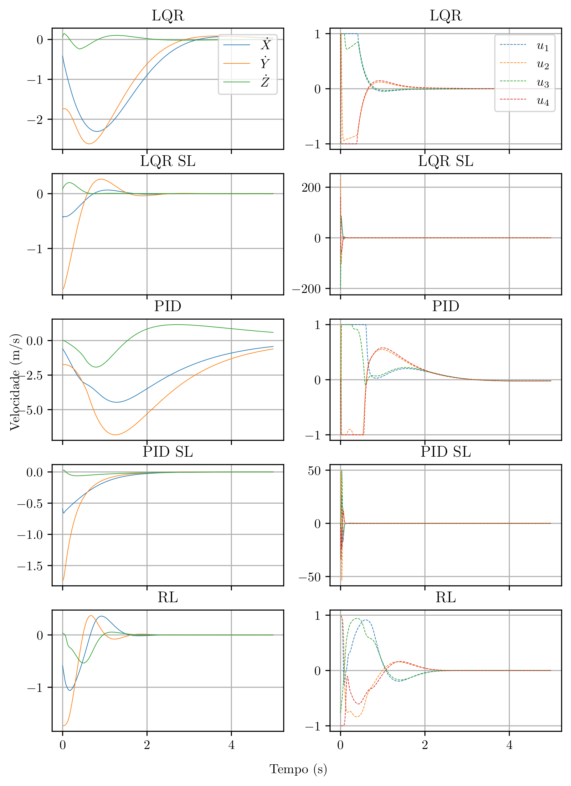
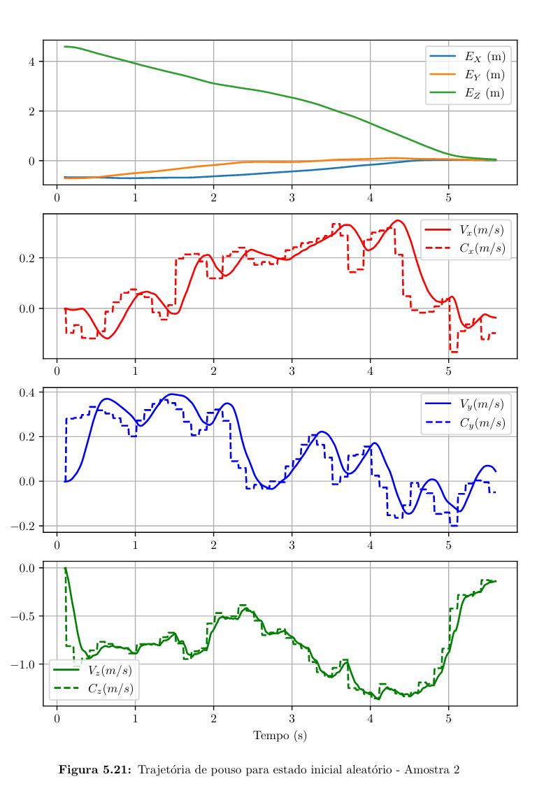

# Machine Learning Based Autonomous Landing and Control of a Quadrotor in GPS Denied Environments

This repository is constantly changing - as my project moves foward. Most of the files are interdependent - Please contact if you have any doubts or would like to use this project, I would be glad to help.

## Quadrotor Control
In ./environment/controller lays the trained controller, ppo algorithm for training new networks, LQR and PID controller to compare. The results are promising, showing a controller that is far better than a linear PID or LQR control, while keeping itself within the actuation bounds of the problem. In ./environment/controller/classical_controller_results it is possible to compare all controllers 

## Quadrotor Landing
The landing simulation and training is a far more complicated task. Panda3D is used to simulate the quadrotor in a 3D virtual environment, this is necessary, as the main focus of this project is to land the quadrotor using a onboard camera (instead of a GPS system). A target is given in the environment, its position is not known and it is randomized each episode. The quadrotor also starts in a randomized position, with the goal to navigate to the target and land safely (within a certain set of rules). The results are also promising, showing 93.5% of succesfull episodes, far better than an average human pilot (averaging 83%) and almost as good as a optimal trajectory (with the target and drones position being known).

The main file to check the landing is ./vldg_eval.py - The computation is done on CUDA, but it is possible to change to CPU within the algorithm.

